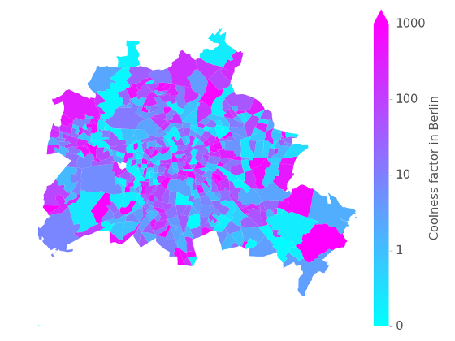
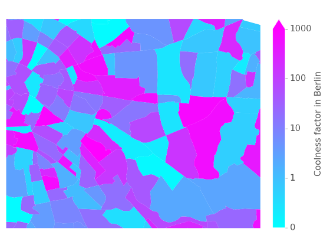
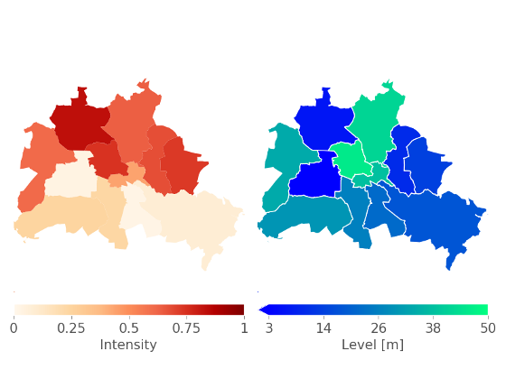
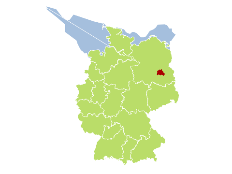
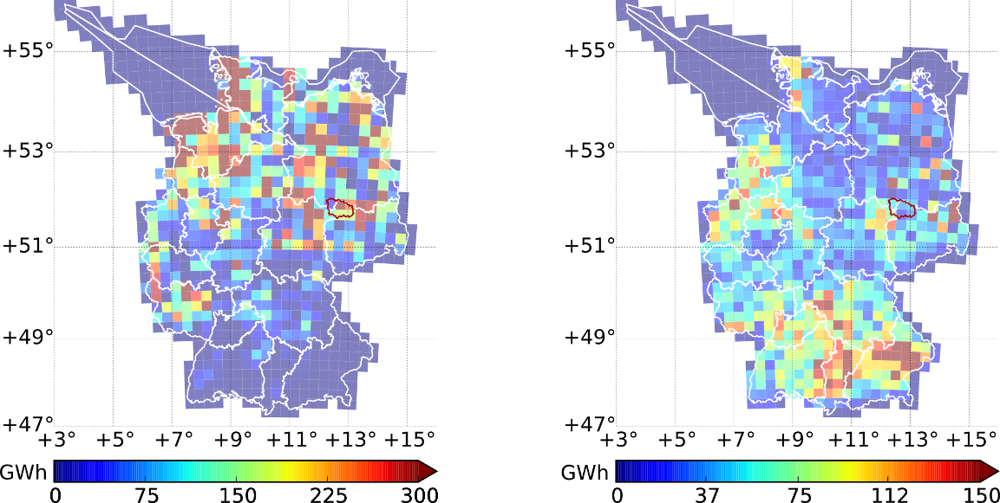
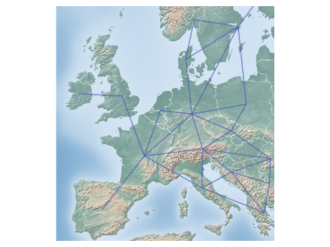

geoplot
-------

A python library to plot shapely objects, combined with data sets.

Installation
============

Use pypi to install the latest version.

.. code:: bash

  pip3 install -e /path/to/your/clone/geoplotlib
  

Gallery
=======

The code of the following maps can be found in the `example file <https://github.com/rl-institut/geoplot/blob/master/examples/basic_examples.py>`_.

Plotting a map based on Berlin's planing regions (random data)
+++++++++++++++++++++++++++++++++++++++++++++++++++++++++++++++
  

   
   
Zooming into the map from above
++++++++++++++++++++++++++++++++

Plotting two maps in one figure
+++++++++++++++++++++++++++++++++    

Plotting different maps into one figure using specific colours
++++++++++++++++++++++++++++++++++++++++++++++++++++++++++++++

(offshore=blue, onshore=green, city=red)
  

Plotting the electrical output of wind (left) and pv (right) power plants
+++++++++++++++++++++++++++++++++++++++++++++++++++++++++++++++++++++++++++++++++++++++++

(Germany, 2012, using the coastDat2 weather data set)
 

Plotting lines onto a relief map from matplotlib basemap
++++++++++++++++++++++++++++++++++++++++++++++++++++++++
 

   
